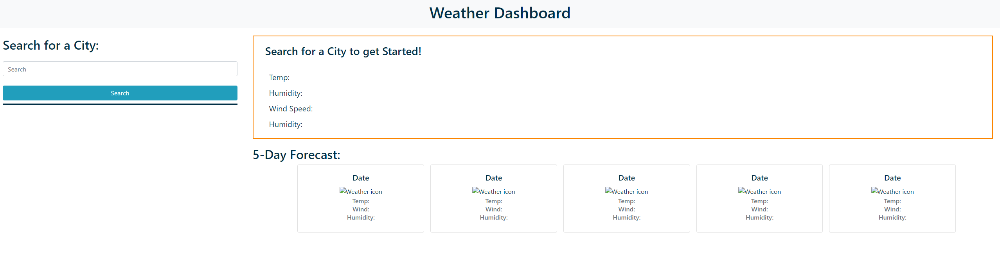
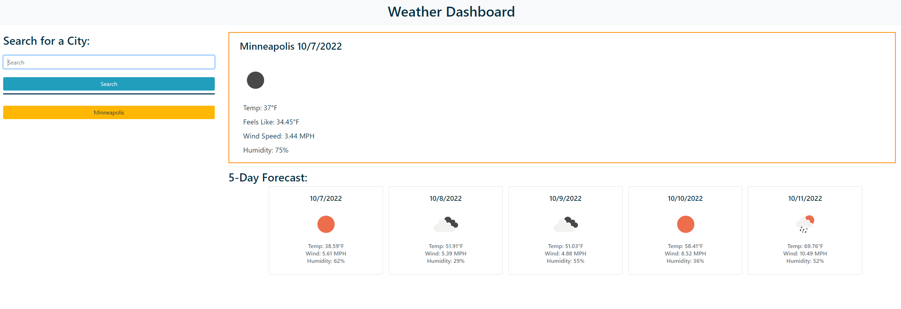
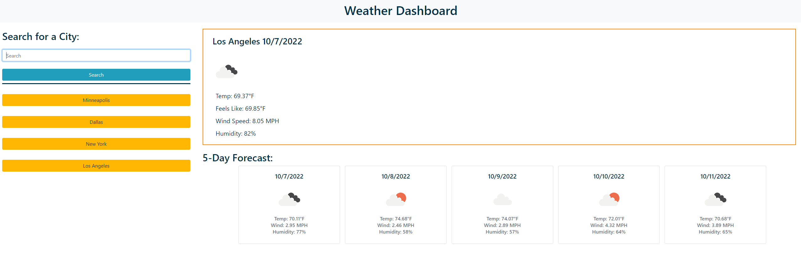

# Five-Day Forecast

## Description

This application was developed to generate a five-day forecast as well as current weather from Server Side API's and display on the screen. The application will also save recent searches and generate buttons with past searches. The weather will display temperature, humidity, wind speed, and an icon showing precipitation/cloudiness. This application is an exercise in using serverside API's with fetch requests using jQuery.

## Installation

The application is hosted on GitHub Pages at the following URL:

https://nambui17.github.io/Weather/

The GitHub Repo is located at the following URL:

https://github.com/nambui17/Weather

## Usage

On webpage load, a search bar is located on the left side of the screen. Enter a city name into the search bar and press "Enter" or the "Return" key to start.

The input box will clear and the webpage will load the current weather data for that city along with a five day weather forecast for the location.

Searching multiple locations will save buttons for your location history, up to 10 results. The searches will remain on webpage reload.

Clicking on the button will search for a location with the button text as the parameter. 

## License

MIT License. Refer to the LICENSE in the repository.

## Badges

